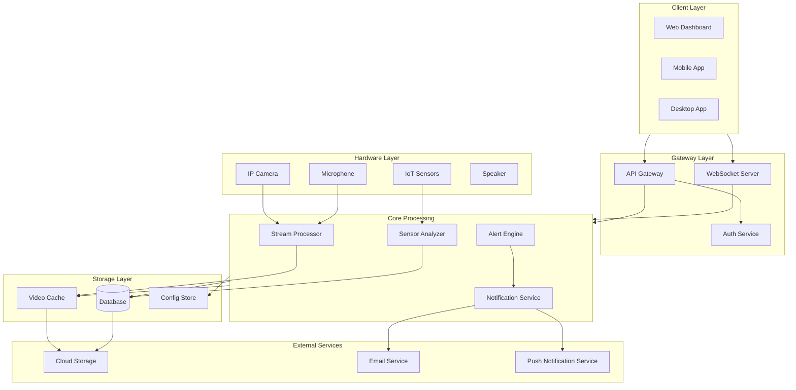
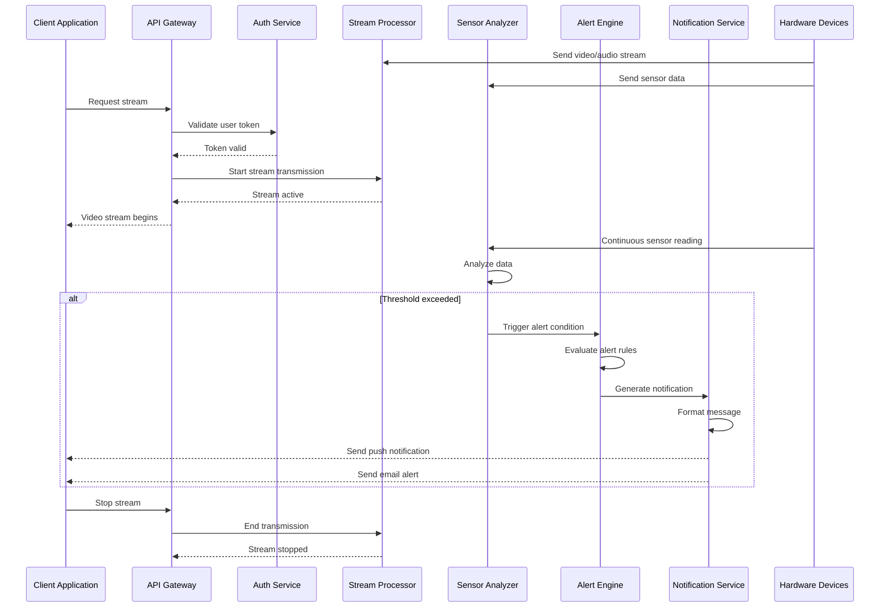
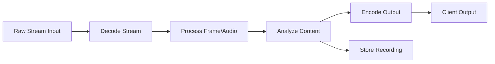
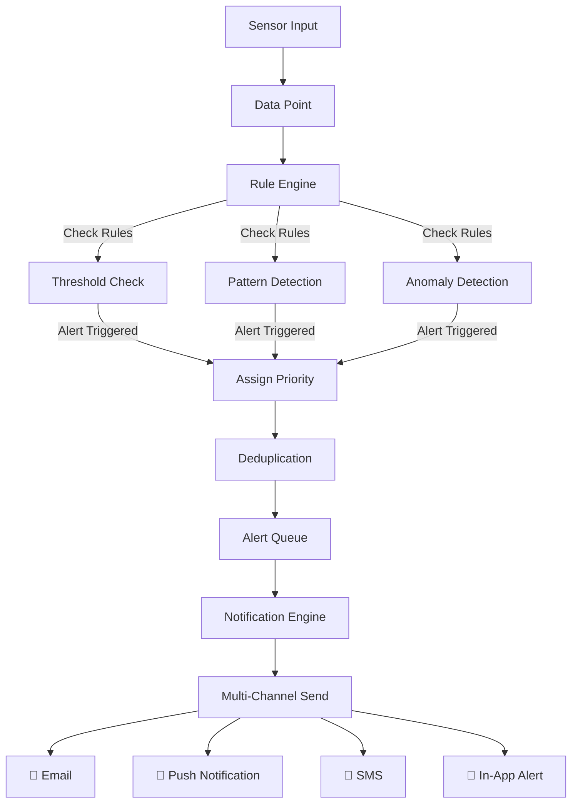
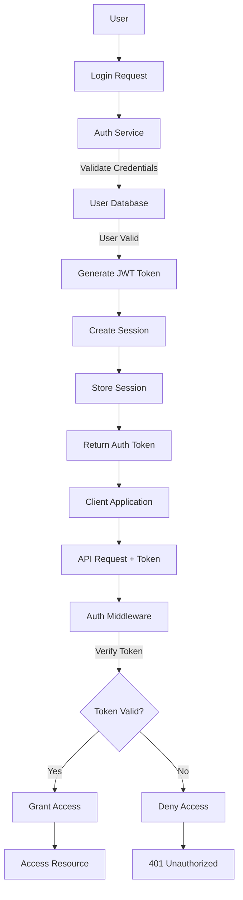
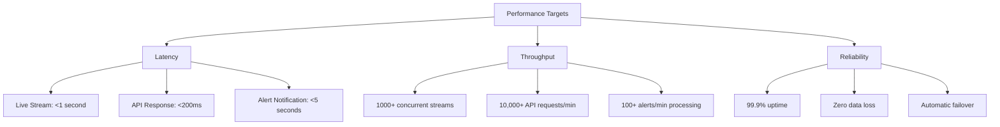

# SimpleBabyMonitor

A lightweight, easy-to-use baby monitoring system designed to provide parents with real-time insights into their child's well-being through video, audio, and sensor monitoring.

## Table of Contents

- [Overview](#overview)
- [Features](#features)
- [System Architecture](#system-architecture)
- [Data Flow](#data-flow)
- [Component Interactions](#component-interactions)
- [Installation](#installation)
- [Configuration](#configuration)
- [Usage](#usage)
- [API Documentation](#api-documentation)
- [Contributing](#contributing)
- [License](#license)

## Overview

SimpleBabyMonitor is a comprehensive solution for monitoring babies and young children. It combines multiple monitoring channels (video, audio, sensors) with intelligent processing and real-time alerts to give parents peace of mind.

### Key Objectives
- **Real-time Monitoring**: Continuous video and audio streaming
- **Smart Alerts**: Intelligent notification system based on sensor data
- **Easy Setup**: Minimal configuration required
- **Secure**: End-to-end encryption for video and audio streams
- **Scalable**: Support for multiple rooms and cameras

## Features

- 📹 **Video Streaming**: High-quality, low-latency video feed
- 🔊 **Audio Monitoring**: Crystal-clear audio with two-way communication
- 🌡️ **Sensor Integration**: Temperature, humidity, and motion detection
- 📱 **Mobile App**: iOS and Android native applications
- 🔔 **Smart Notifications**: Customizable alerts based on thresholds
- 🔐 **Security**: Encrypted streams and secure authentication
- 👥 **Multi-User**: Share access with family members
- ☁️ **Cloud Backup**: Optional cloud storage for recorded clips
- 🎙️ **Two-Way Talk**: Communicate with your child remotely

## System Architecture



## Data Flow



## Component Interactions

### 1. Stream Processing Pipeline



### 2. Alert System Flow



### 3. User Authentication & Authorization



## Installation

### Prerequisites

- Node.js >= 14.0.0
- Docker (optional, for containerized deployment)
- Python >= 3.8 (for sensor processing backend)
- FFmpeg (for video stream processing)

### Quick Start

1. **Clone the repository**
   ```bash
   git clone https://github.com/j-sed/SimpleBabyMonitor.git
   cd SimpleBabyMonitor
   ```

2. **Install dependencies**
   ```bash
   # Backend dependencies
   npm install
   
   # Frontend dependencies
   cd frontend
   npm install
   ```

3. **Install system dependencies**
   ```bash
   # Ubuntu/Debian
   sudo apt-get install ffmpeg
   
   # macOS
   brew install ffmpeg
   ```

4. **Set up environment variables**
   ```bash
   cp .env.example .env
   nano .env  # Edit with your configuration
   ```

5. **Initialize database**
   ```bash
   npm run db:migrate
   npm run db:seed
   ```

6. **Start the application**
   ```bash
   npm run dev
   ```

### Docker Deployment

```bash
# Build image
docker build -t simple-baby-monitor .

# Run container
docker run -d \
  -p 3000:3000 \
  -p 8080:8080 \
  -e NODE_ENV=production \
  -v /path/to/config:/app/config \
  -v /path/to/videos:/app/videos \
  simple-baby-monitor
```

## Configuration

### Environment Variables

Create a `.env` file in the root directory:

```env
# Server Configuration
NODE_ENV=development
PORT=3000
LOG_LEVEL=info

# Database
DB_HOST=localhost
DB_PORT=5432
DB_NAME=baby_monitor
DB_USER=admin
DB_PASSWORD=your_secure_password

# JWT Configuration
JWT_SECRET=your_jwt_secret_key
JWT_EXPIRY=24h

# Stream Configuration
STREAM_BITRATE=2500k
STREAM_FPS=30
STREAM_RESOLUTION=1280x720
MAX_STREAM_TIMEOUT=3600

# Storage
STORAGE_PATH=/var/lib/baby-monitor/videos
STORAGE_QUOTA_GB=500
ENABLE_CLOUD_BACKUP=true

# Notification Services
SMTP_HOST=smtp.gmail.com
SMTP_PORT=587
SMTP_USER=your_email@gmail.com
SMTP_PASSWORD=your_app_password

PUSH_NOTIFICATION_KEY=your_fcm_key
SMS_PROVIDER=twilio
SMS_ACCOUNT_SID=your_account_sid

# Security
ENABLE_HTTPS=true
CERT_PATH=/etc/ssl/certs/cert.pem
KEY_PATH=/etc/ssl/private/key.pem

# Feature Flags
ENABLE_TWO_WAY_TALK=true
ENABLE_MOTION_DETECTION=true
ENABLE_CRYING_DETECTION=true
ENABLE_CLOUD_STORAGE=true
```

### Device Configuration

Create `config/devices.json`:

```json
{
  "cameras": [
    {
      "id": "camera_bedroom",
      "name": "Bedroom Camera",
      "url": "rtsp://192.168.1.100:554/stream",
      "username": "admin",
      "password": "password",
      "room": "bedroom",
      "enabled": true,
      "recording": {
        "enabled": true,
        "quality": "high",
        "retention_days": 30
      }
    }
  ],
  "sensors": [
    {
      "id": "sensor_bedroom_temp",
      "name": "Bedroom Temperature",
      "type": "temperature",
      "device_id": "sensor_001",
      "unit": "celsius",
      "min_threshold": 16,
      "max_threshold": 28,
      "room": "bedroom"
    },
    {
      "id": "sensor_bedroom_motion",
      "name": "Bedroom Motion",
      "type": "motion",
      "device_id": "sensor_002",
      "sensitivity": "high",
      "room": "bedroom"
    }
  ]
}
```

## Usage

### Web Dashboard

1. **Open browser and navigate to:**
   ```
   http://localhost:3000
   ```

2. **Login with credentials**
   - Default username: `admin@example.com`
   - Default password: `changeme123` (change immediately in production)

3. **Add a device**
   - Go to Settings → Devices
   - Click "Add New Device"
   - Enter device IP, username, and password
   - Click "Connect"

4. **Monitor your baby**
   - Click on the camera feed in the dashboard
   - Adjust volume with audio controls
   - Use "Talk" button for two-way communication

### Mobile App Usage

#### iOS
1. Download SimpleBabyMonitor from App Store
2. Sign in with your account
3. Grant camera and microphone permissions
4. Select device to monitor

#### Android
1. Download SimpleBabyMonitor from Google Play
2. Sign in with your account
3. Grant camera and microphone permissions
4. Select device to monitor

### Alert Configuration

1. **Go to Settings → Alerts**
2. **Configure alert rules:**
   - Temperature alerts: Set min/max thresholds
   - Motion alerts: Enable/disable and set sensitivity
   - Sound alerts: Set volume threshold for crying detection
   - Scheduled alerts: Set quiet hours

3. **Choose notification channels:**
   - ✓ Push Notifications
   - ✓ Email
   - ✓ SMS
   - ✓ In-App Notifications

### Advanced Features

#### Two-Way Talk
```
Dashboard → Select Camera → Click "Talk" Button
→ Speak into microphone → Audio transmitted to speaker
```

#### Recording Management
```
Dashboard → Select Camera → "Recordings" Tab
→ View recorded clips → Download or delete as needed
```

#### Export Data
```
Settings → Data Export
→ Select date range → Choose format (CSV/JSON)
→ Download exported data
```

## API Documentation

### Authentication

All API endpoints require a valid JWT token in the Authorization header:

```bash
Authorization: Bearer YOUR_JWT_TOKEN
```

### Base URL

```
http://localhost:3000/api/v1
```

### Endpoints

#### Users
```
POST   /auth/login              # Login user
POST   /auth/logout             # Logout user
POST   /auth/register           # Register new account
POST   /auth/refresh-token      # Refresh JWT token
GET    /users/profile           # Get current user profile
PUT    /users/profile           # Update user profile
```

#### Devices
```
GET    /devices                 # List all devices
POST   /devices                 # Add new device
GET    /devices/:id             # Get device details
PUT    /devices/:id             # Update device
DELETE /devices/:id             # Remove device
POST   /devices/:id/test        # Test device connection
```

#### Streaming
```
GET    /stream/:device_id       # WebSocket endpoint for streaming
POST   /stream/:device_id/start # Start recording
POST   /stream/:device_id/stop  # Stop recording
GET    /stream/:device_id/status# Get stream status
```

#### Sensors
```
GET    /sensors                 # List all sensors
GET    /sensors/:id/data        # Get sensor readings
GET    /sensors/:id/history     # Get historical data
POST   /sensors/:id/calibrate   # Calibrate sensor
```

#### Alerts
```
GET    /alerts                  # List all alerts
GET    /alerts/:id              # Get alert details
PUT    /alerts/:id              # Update alert settings
DELETE /alerts/:id              # Delete alert rule
GET    /alerts/history          # Get alert history
```

#### Recordings
```
GET    /recordings              # List recordings
GET    /recordings/:id          # Get recording details
GET    /recordings/:id/download # Download recording
DELETE /recordings/:id          # Delete recording
POST   /recordings/cleanup      # Cleanup old recordings
```

### Example Requests

**Login:**
```bash
curl -X POST http://localhost:3000/api/v1/auth/login \
  -H "Content-Type: application/json" \
  -d '{
    "email": "user@example.com",
    "password": "password123"
  }'
```

**Get Device List:**
```bash
curl -X GET http://localhost:3000/api/v1/devices \
  -H "Authorization: Bearer YOUR_JWT_TOKEN"
```

**Start Stream:**
```bash
curl -X POST http://localhost:3000/api/v1/stream/camera_bedroom/start \
  -H "Authorization: Bearer YOUR_JWT_TOKEN"
```

## Architecture Components

### Frontend
- **Framework**: React.js
- **State Management**: Redux
- **UI Library**: Material-UI
- **Real-time**: Socket.IO
- **Video Player**: HLS.js

### Backend
- **Runtime**: Node.js
- **Framework**: Express.js
- **Database**: PostgreSQL
- **Cache**: Redis
- **Message Queue**: RabbitMQ
- **Video Processing**: FFmpeg

### Infrastructure
- **Containerization**: Docker
- **Orchestration**: Kubernetes (optional)
- **Monitoring**: Prometheus + Grafana
- **Logging**: ELK Stack
- **CI/CD**: GitHub Actions

## Performance Metrics



## Troubleshooting

### Common Issues

**Stream Connection Failed**
- Check network connectivity
- Verify device IP address and credentials
- Ensure firewall allows traffic on ports 554 (RTSP) and 5000 (HTTP)
- Check device logs: `docker logs simple-baby-monitor`

**Audio Not Working**
- Verify microphone is enabled in device settings
- Check browser microphone permissions
- Ensure speaker is powered on and volume is not muted
- Test microphone with system settings

**High CPU Usage**
- Reduce stream resolution in settings
- Lower frame rate (FPS)
- Disable recording if not needed
- Check for memory leaks: `npm run analyze:memory`

**Database Connection Error**
- Verify PostgreSQL is running
- Check database credentials in `.env`
- Ensure network connectivity to database server
- Run migrations: `npm run db:migrate`

**Alerts Not Triggering**
- Verify sensor is connected and reporting data
- Check alert rules configuration
- Review alert logs: `npm run logs:alerts`
- Test alert manually from admin panel

## Security Best Practices

1. **Authentication**
   - Change default credentials immediately
   - Enable two-factor authentication
   - Use strong passwords (min 12 characters)
   - Rotate JWT secrets regularly

2. **Network Security**
   - Use HTTPS/TLS for all connections
   - Enable firewall rules
   - Use VPN for remote access
   - Restrict API access by IP (optional)

3. **Data Protection**
   - Enable video encryption
   - Use encrypted storage for recordings
   - Regular backup of configuration and databases
   - GDPR/CCPA compliance measures

4. **Monitoring**
   - Enable security logging
   - Monitor failed login attempts
   - Review access logs regularly
   - Set up security alerts

## Contributing

We welcome contributions! Please follow these steps:

1. Fork the repository
2. Create a feature branch (`git checkout -b feature/amazing-feature`)
3. Commit your changes (`git commit -m 'Add amazing feature'`)
4. Push to the branch (`git push origin feature/amazing-feature`)
5. Open a Pull Request

### Development Setup

```bash
# Clone your fork
git clone https://github.com/YOUR_USERNAME/SimpleBabyMonitor.git

# Install dependencies
npm install

# Start development server
npm run dev

# Run tests
npm run test

# Run linter
npm run lint
```

### Testing

```bash
# Unit tests
npm run test:unit

# Integration tests
npm run test:integration

# E2E tests
npm run test:e2e

# Coverage report
npm run test:coverage
```

## License

This project is licensed under the MIT License - see the [LICENSE](LICENSE) file for details.

## Support

- 📖 **Documentation**: https://docs.simplebabymonitor.dev
- 🐛 **Report Issues**: https://github.com/j-sed/SimpleBabyMonitor/issues
- 💬 **Discussions**: https://github.com/j-sed/SimpleBabyMonitor/discussions
- 📧 **Email Support**: support@simplebabymonitor.dev

## Changelog

### Version 1.0.0 (2025-12-12)
- Initial release
- Basic video/audio streaming
- Sensor integration
- Alert system
- Mobile app support
- Cloud backup

## Roadmap

- [ ] AI-powered behavioral analysis
- [ ] Emotion recognition
- [ ] Sleep quality analysis
- [ ] Growth tracking integration
- [ ] Wearable device integration
- [ ] Advanced analytics dashboard
- [ ] Multi-language support
- [ ] HIPAA compliance certification

## Authors

- **Developers**: SimpleBabyMonitor Team
- **Repository**: https://github.com/j-sed/SimpleBabyMonitor

## Acknowledgments

- Thanks to all contributors and testers
- Special thanks to the open-source community
- Icons from [Material Design Icons](https://materialdesignicons.com/)

---

**Last Updated**: December 12, 2025

**Status**: Active Development ✓
